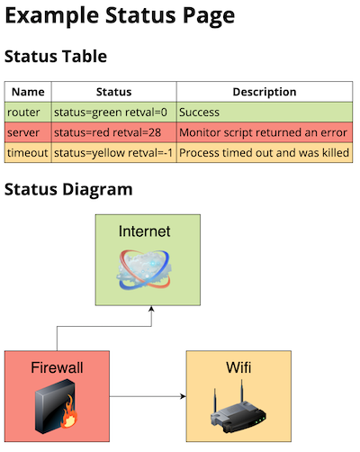
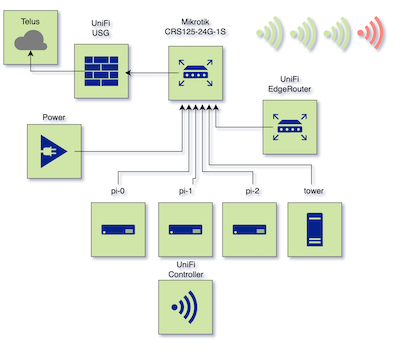

# stylus 

**Stylus** (_style + status_) is a lightweight status page for home infrastructure. Configure a set of bash scripts that test
the various parts of your infrastructure, set up HTML/SVG with a diagram of your network, and stylus will
generate you a dynamic stylesheet to give you a visual overview of the current state.

Note that this project was originally written using deno, but was rewritten in Rust to support Raspberry Pis. The
original deno source is available in the `deno` branch.

## Running

```
cargo run -- example/config.yaml
```

Or install via `cargo`:

```
cargo install stylus
```

Or on docker:

```
# Assume that this is started with $PWD in the example/ directory
docker run --rm -p 8000:8000 -v $PWD:/srv mmastrac/stylus:latest
```

## Theory of operation

**Stylus** acts as a webserver with special endpoints and a status monitoring tool.

The status monitoring portion is based around scripts, written in any shell scripting language you like. Each
script is run on an interval, and if the script returns `0` that is considered "up" for a given service. If the
service times out, or returns a non-zero error this is considered a soft ("yellow") or hard ("red") failure.

The special endpoints available on the webserver are:

  * `/style.css`: A dynamically generated CSS file based on the current
  * `/status.json`: A JSON representation of the current state

The `style.css` endpoint may be linked by a HTML or SVG file served from the `static` directory that is configured. If
desired, the HTML page can dynamically refresh the CSS periodically using Javascript. See the included example for a
sample of how this might work.

## Getting started

The first step to get started is copying the example to a location you'd like to use to run your status monitoring
scripts. For each of the servers you'd like to monitor, create a new subdirectory under `monitor.d` with the name of
that server.

Using a tool like [diagrams.net], create an SVG diagram of your network. Attach an SVG DOM attribute to the elements
you'd like to style with status changes. If you're using [diagrams.net], this can be done using the `svgdata` plugin.
Alternatively, you can use the automatic identifiers generated by your SVG editor as your monitoring identifiers.

From the SVG you've generated, create CSS selectors and rules that will apply styles to the appropriate elements as
statuses change. The SVG `fill` attribute is a good candidate to change, but ensure that you're using `!important` on
all your rules to override the fill colors created by your SVG editor.

## Configuration

Example `config.yaml` for a **Stylus** install. This configuration attaches metadata to the various states and has
selectors that apply to both and HTML (for a status table) and CSS (for a status SVG image).

```
version: 1
server:
  port: 8000
  static: static/

monitor:
  dir: monitor.d/

css:
  # Arbitrary metadata can be associated with the three states
  metadata:
    red:
      color: "#fa897b"
    yellow:
      color: "#ffdd94"
    green:
      color: "#d0e6a5"
  rules:
    # Multiple CSS rules with handlebars replacements are supported
    - selectors: "#{{monitor.config.id}}"
      declarations: "
        background-color: {{monitor.status.css.metadata.color}} !important;
      "
```

The monitors are configured by creating a subdirectory in the monitor directory (default `monitor.d/`) and
placing a `config.yaml` in that monitor subdirectory.

```
# ID is optional and will be inferred from the directory
id: router-1
test:
  interval: 60s
  timeout: 30s
  command: test.sh
```

## Screenshots

### Included example



### My personal network



[diagrams.net]: https://www.diagrams.net/
