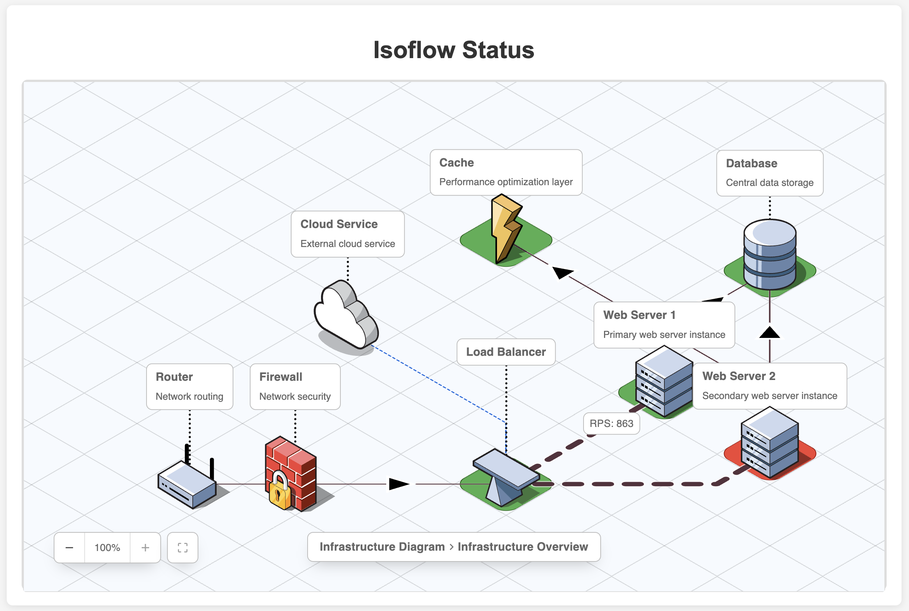
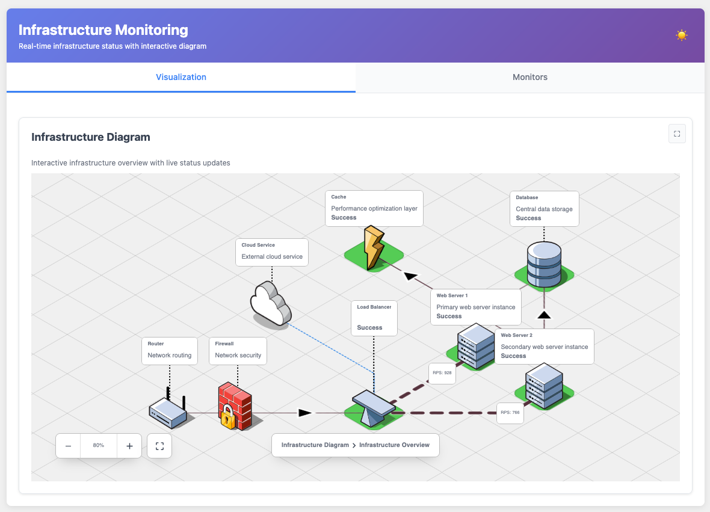
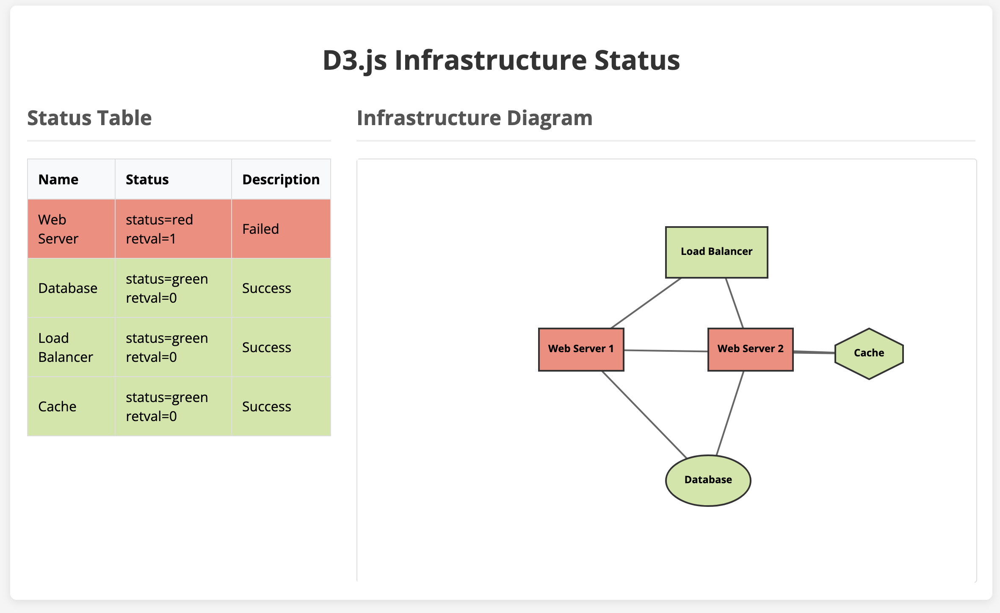
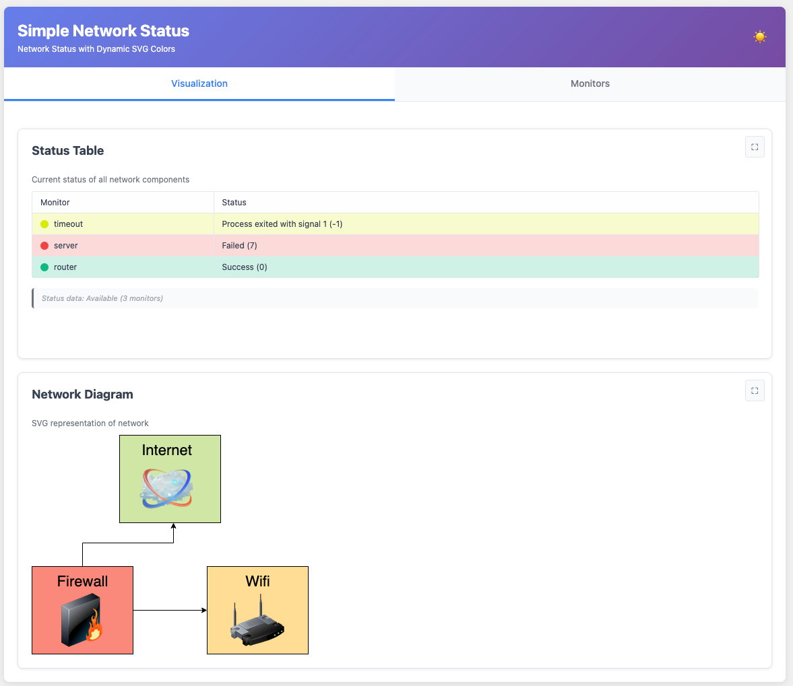

# stylus [](https://github.com/mmastrac/stylus/actions/workflows/build.yml) [](https://crates.io/crates/stylus) [](https://hub.docker.com/r/mmastrac/stylus) [](https://mmastrac.github.io/stylus/)

**Stylus** (_style + status_) is a lightweight status page for home
infrastructure. Configure a set of bash scripts that test the various parts of
your infrastructure, set up HTML/SVG with a diagram of your network, and stylus
will generate you a dynamic stylesheet to give you a visual overview of the
current state.



[diagrams.net]: https://app.diagrams.net/?splash=0&p=svgdata

## Running

[See the book page on running Stylus here](https://mmastrac.github.io/stylus/getting-started/running.html).

## Theory of operation

**Stylus** acts as a webserver with special endpoints and a status monitoring
tool.

The status monitoring portion is based around scripts, written in any shell
scripting language you like. Each script is run on an interval, and if the
script returns `0` that is considered "up" for a given service. If the service
times out, or returns a non-zero error this is considered a soft ("yellow") or
hard ("red") failure.

The special endpoints available on the webserver are:

- `/style.css`: A dynamically generated CSS file based on the current
- `/status.json`: A JSON representation of the current state

The `style.css` endpoint may be linked by a HTML or SVG file served from the
`static` directory that is configured. If desired, the HTML page can dynamically
refresh the CSS periodically using Javascript. See the included example for a
sample of how this might work.

If you need more flexibility than CSS can provide, you can use the `status.json`
endpoint to get the current status of the various services and dynamically
update the HTML DOM, SVG images, a React.js application or something more
complex.

## Getting started

The first step to get started is copying the example to a location you'd like to
use to run your status monitoring scripts. For each of the servers you'd like to
monitor, create a new subdirectory under `monitor.d` with the name of that
server.

Using a tool like [diagrams.net], create an SVG diagram of your network. Attach
an SVG DOM attribute to the elements you'd like to style with status changes. If
you're using [diagrams.net], this can be done using the `svgdata` plugin.
Alternatively, you can use the automatic identifiers generated by your SVG
editor as your monitoring identifiers.

From the SVG you've generated, create CSS selectors and rules that will apply
styles to the appropriate elements as statuses change. The SVG `fill` attribute
is a good candidate to change, but ensure that you're using `!important` on all
your rules to override the fill colors created by your SVG editor.

## Configuration

Example `config.yaml` for a **Stylus** install. This configuration attaches
metadata to the various states and has selectors that apply to both and HTML
(for a status table) and CSS (for a status SVG image).

```yaml
version: 1
server:
  port: 8000
  static: static/

monitor:
  dir: monitor.d/

css:
  # Arbitrary metadata can be associated with the four states
  metadata:
    blank:
      color: "white"
    red:
      color: "#fa897b"
    yellow:
      color: "#ffdd94"
    green:
      color: "#d0e6a5"
  rules:
    # Multiple CSS rules with handlebars replacements are supported
    - selectors: "#{{monitor.id}}"
      declarations: "
        background-color: {{monitor.status.css.metadata.color}} !important;
      "
```

The monitors are configured by creating a subdirectory in the monitor directory
(default `monitor.d/`) and placing a `config.yaml` in that monitor subdirectory.

```yaml
# ID is optional and will be inferred from the directory
id: router-1
test:
  interval: 60s
  timeout: 30s
  command: test.sh
```

## Test scripts

The test scripts are usually pretty simple. Note that the docker container ships
with a number of useful utilities, but you can consider manually installing
additional packages (either creating an additional docker container or manually
running alpine's `apk` tool inside the container) to handle your specific cases.

### Ping

Unless you have a particularly lossy connection, a single ping should be enough
to test whether a host is up:

```bash
#!/bin/bash
set -xeuf -o pipefail
ping -c 1 8.8.8.8
```

### cURL

For hosts with services that may be up or down, you may want to use cURL to test
whether the service itself is reachable.

```bash
#!/bin/bash
set -xeuf -o pipefail
curl --retry 2 --max-time 5 --connect-timeout 5 http://192.168.1.1:9000
```

### Advanced techniques

Tools such as `jq`, `sed`, or `awk` can be used for more advanced tests (ie:
APIs). If needed, ssh can be used to connect to hosts and remote tests can be
executed. `snmpwalk` and `snmpget` can also be used to construct tests for
devices that speak SNMP.

If you have an existing **grafana** instance, you can use that as a monitoring
source. See the [Grafana HTTP
API](https://grafana.com/docs/grafana/latest/developers/http_api/) documentation
for more information.

## Performance

**Stylus** is very lightweight, both from a processing and memory perspective.

On a Raspberry Pi 1B, **Stylus** uses less than 1% of CPU while refreshing CSS
at a rate of 1/s. On a 2015 MacBook Pro, Stylus uses approximately 0.1% of a
single core while actively refreshing.

**Stylus** uses approxmately 2MB to monitor 15 services on a Raspberry Pi
(according to
[ps_mem](https://raw.githubusercontent.com/pixelb/ps_mem/master/ps_mem.py)).

When not actively monitored, **Stylus** uses a nearly unmeasurable amount of CPU
and is pretty much limited by how heavyweight your test scripts are.

## Screenshots

### Included example



### D3.js example



### Isoflow example


### A basic home network diagram



[diagrams.net]: https://app.diagrams.net/?splash=0&p=svgdata

## Historical Note

Note that this project was originally written using deno, but was rewritten in
Rust to support Raspberry Pis. The original deno source is available in the
`deno` branch.
