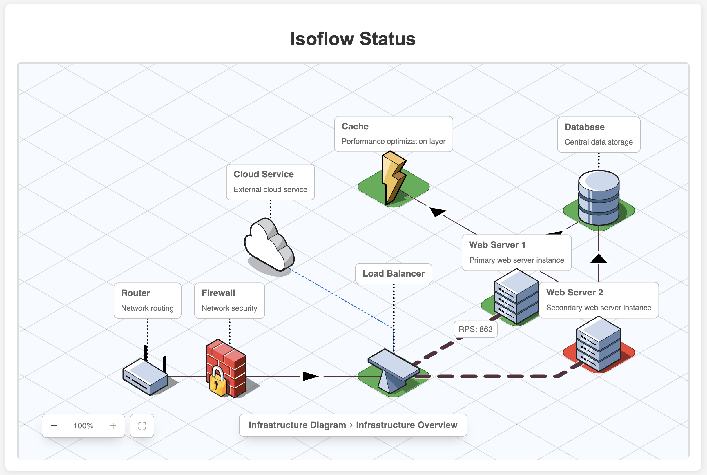

# Creating Custom Monitor Pages

**Stylus** ships with a built-in webapp that includes a number of visualizations,
but you can also use it to serve any content you like, even fully replacing the
built-in webapp.

## Rendering Technologies

**Stylus** works particularly well with
[SVG](https://en.wikipedia.org/wiki/Scalable_Vector_Graphics) diagrams, but can
use any markup language that supports either CSS or dynamic updates via JSON
data (eg: [Angular](https://angular.io/), [React](https://reactjs.org/), etc).

### HTML

React is a popular library for building user interfaces. Using `/status.json`
as the data source, you can create a simple page with the current state of the
monitors.

The [IsoFlow](https://isoflow.io) component for React allows you to load a model
and render it as an isometric diagram with a little bit of glue in **Stylus**:



### SVG

SVG is a flexible image format that conveniently supports CSS styling. See the
[SVG tutorial](../tutorials/svg-diagrams.html) for more details on building a
diagram using [diagrams.net](https://app.diagrams.net/).

[d3.js](https://d3js.org/) is a popular library for creating interactive
diagrams. See the [`d3.js` example in the
repository](https://github.com/mmastrac/stylus/tree/master/examples/d3) for an
example of how to use it with **Stylus**.

## Hooks and Endpoints

There are number of provided hooks for updating status, and depending on which
technology you'd like to use for your status page, you can choose which one
makes sense.

Monitors are independent of the the technology you use to render your page, so
you can start with a very basic page and then add more complexity as you go.

## CSS

The simplest way to create a monitoring page is to use CSS to update the
status of the page.

The `/style.css` route serves live CSS with the current state of the monitors.

For each monitor, **Stylus** will generate a CSS block with the current state of
the monitor as CSS variables (including any metadata your script has generated):

```css
[data-monitor-id="web-server-1"] {
  --monitor-id: "web-server-1";
  --monitor-status: green;
  --monitor-code: 0;
  --monitor-description: "Success";
  --monitor-metadata-rps: RPS: 702;
}
```

These CSS variables can be used for basic styling of the page, but it is highly
recommended to generate more complex CSS rules to style the page.

In your project's `config.yaml` file, you can specify a number of rules to
style the page. For each rules in this section, a CSS block will be generated
for each monitor.

For example, adding these rules:

```yaml
  # Specify a number of rules - selector/declaration pairs. Each pair will generate a CSS block.
  rules:
    # Style the HTML/SVG with the appropriate status color
    - selectors: |
        #{{monitor.id}},
        [data-monitor-id="{{monitor.id}}"] > *
      declarations: |
        background-color: {{monitor.status.css.metadata.color}} !important;
        fill: {{monitor.status.css.metadata.color}} !important;
```

... will generate the following CSS block for each monitor:

```css
/* web-server-1 */

/* Default rules */
[data-monitor-id="web-server-1"] {
  --monitor-id: "web-server-1";
  --monitor-status: green;
  --monitor-code: 0;
  --monitor-description: "Success";
  --monitor-metadata-rps: RPS: 702;
}
#web-server-1, [data-monitor-id="web-server-1"] {
    background-color: #d0e6a5 !important;
    fill: #d0e6a5 !important;
}
```

See the [CSS Configuration](../configuration/css/) section for more details.

## JSON

The `/status.json` route serves the current state of the monitors as JSON.

This can be used for dynamic rendering of the page, or for updating the page
with a script.

Each monitor's latest status is available in the JSON response, along with its
log output, and any metadata generated by the monitor script.

```json
{
    "id": "database",
    "config": {
        "interval": "5s",
        "timeout": "15s",
        "command": "..."
    },
    "status": {
        "status": "green",
        "code": 0,
        "description": "Success",
        "css": {
            "metadata": {
                "color": "#d0e6a5"
            }
        },
        "metadata": {},
        "log": [
            "2025-07-08T23:51:05.732946+00:00 [exec  ] Starting",
            "..."
        ]
    },
    "children": {}
}
```

The `/config.json` route serves the global configuration for the project.

```json
{
    "version": 1,
    "server": {
        "port": 8000,
        "listen_addr": "0.0.0.0"
    },
    "monitor": {
        "dir": "monitor.d"
    }
}
```

