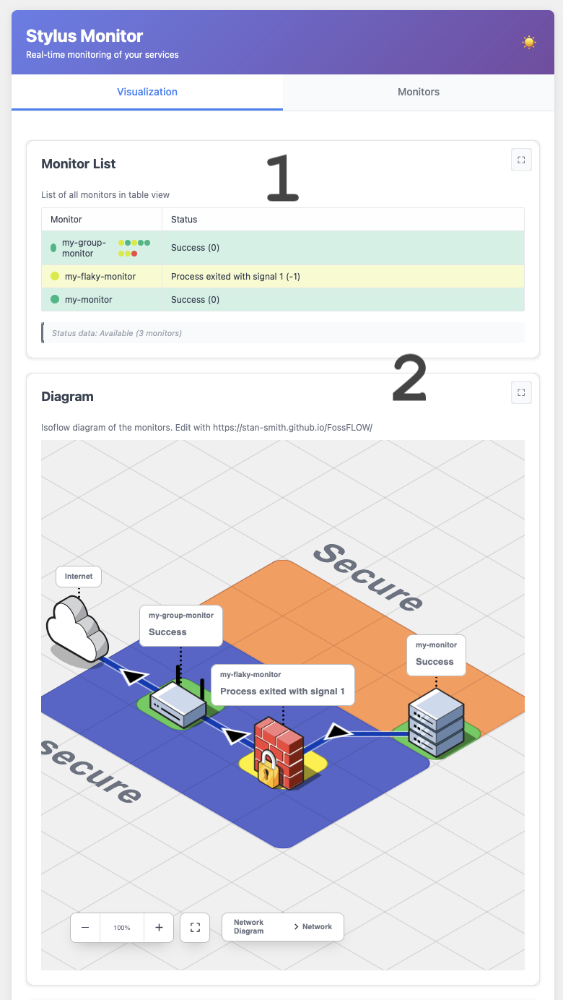
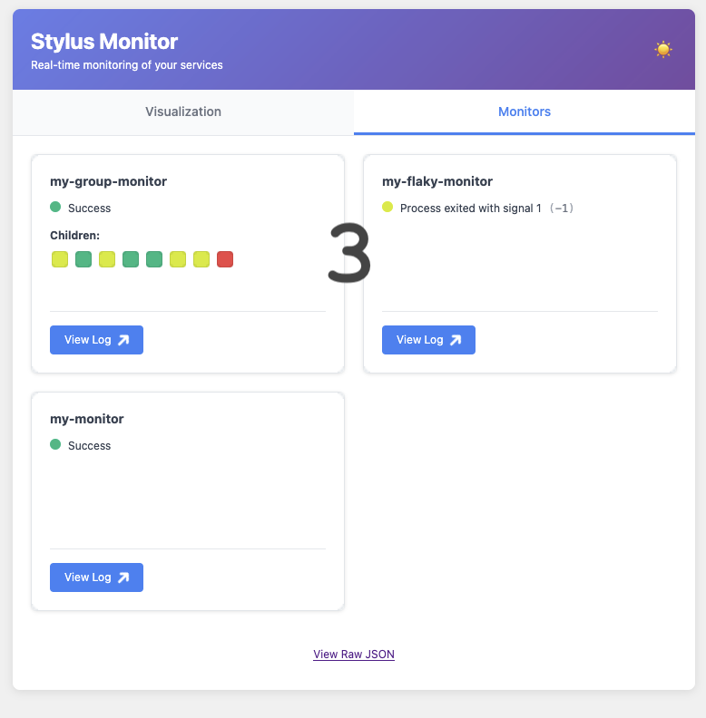

# Creating a **Stylus** Project

You can create a new **Stylus** project by running the `stylus init` command. This creates a new directory with a default configuration and a `monitor.d` directory with a single monitor test.

```bash session
$ stylus init ~/stylus
Initializing directory: "~/stylus"...
Done!

Run `stylus "~/stylus"` to start the server

$ tree ~/stylus/
├── README.md
├── config.d
│   └── isoflow.json
├── config.yaml
├── monitor.d
│   ├── my-flaky-monitor
│   │   ├── config.yaml
│   │   └── test.sh
│   ├── my-group-monitor
│   │   ├── config.yaml
│   │   └── test.sh
│   └── my-monitor
│       ├── config.yaml
│       └── test.sh
└── static
    ├── README.md
    └── iframe.html
```

Once you've created the project, you can start the server with the `stylus run` command.

```bash
stylus run ~/stylus
```

If you open your web browser to `http://localhost:8000`, you should see a
very basic default page with a green status. You'll also find a link to the
status JSON and style CSS endpoints, as well as the per-monitor log output:

By default, **Stylus** renders a basic summary page for all of your monitors.
This lets you work on your monitors before creating any custom pages. When you
open the default project, you'll see three sections:

1. A table visualization showing all the monitors
2. An Isoflow visualization, updating the diagram when the status changes
3. The monitor page listing the raw monitors, and their status, along with a
   button to view the log output for each



