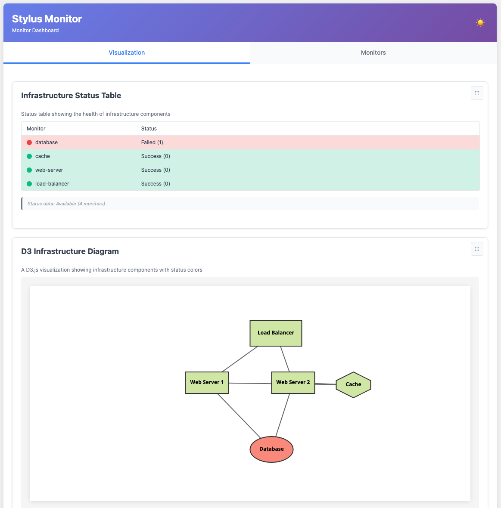
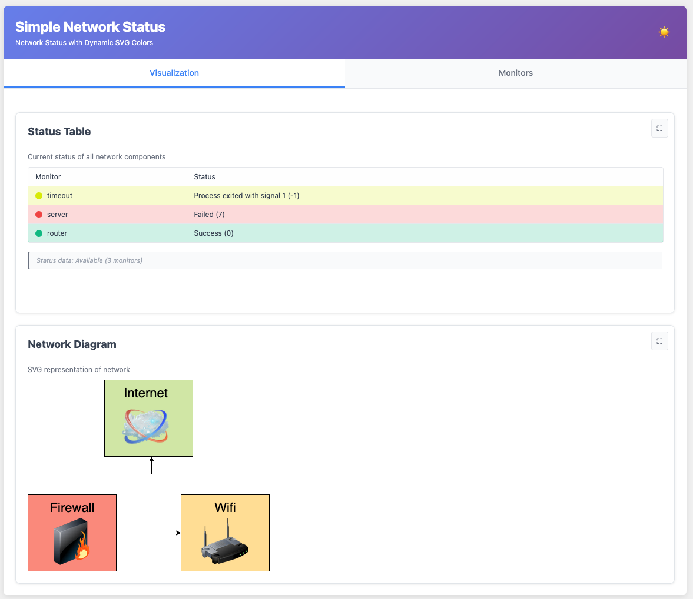
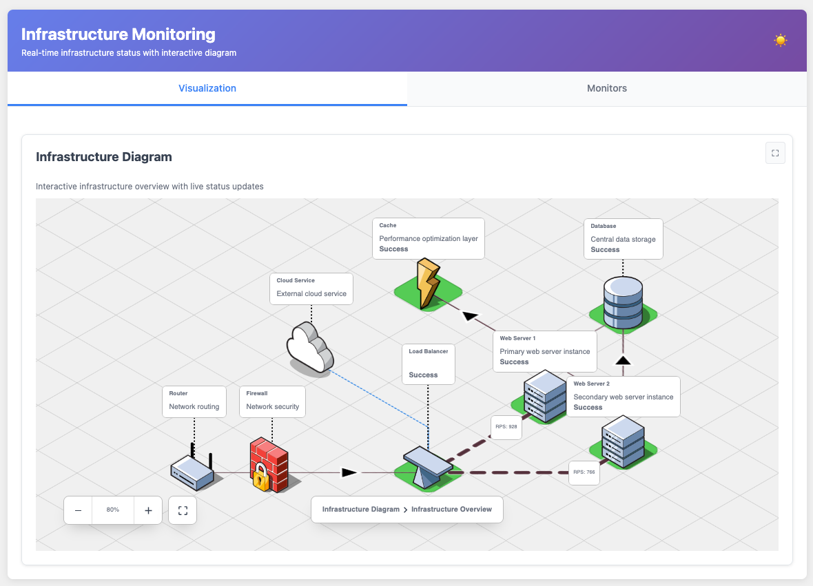

# Stylus Documentation Home

**Stylus** (_style + status_) is a lightweight status page for home
infrastructure. 

Configure a set of scripts in bash, Python or any other language that test the
various parts of your infrastructure, set up HTML/SVG with a diagram of your
network, and stylus will generate you a dynamic stylesheet to give you a visual
overview of the current state.

## Screenshots

These are some examples of what you can do with **Stylus**:

Using the d3.js library:

Using the IsoFlow library:

Using an SVG diagram:

Using a basic HTML page:

## Sections

* [Getting Started](getting-started/overview.md)
* [Configuration](configuration/server/README.md)
* [Examples](configuration/general-tips.md)
